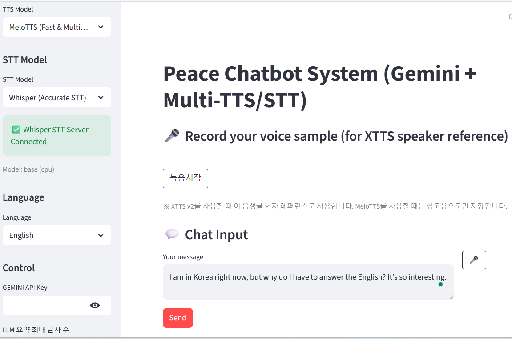

# My Voice Lab 🎙️

**AI 음성 챗봇 시스템** - Gemini LLM + Multi-TTS/STT 통합 플랫폼

[](https://www.python.org/downloads/)
[](https://streamlit.io/)
[](LICENSE)

---

## 📖 목차

- [프로젝트 소개](#-프로젝트-소개)
- [주요 기능](#-주요-기능)
- [시스템 아키텍처](#-시스템-아키텍처)
- [빠른 시작](#-빠른-시작)
- [TTS 모델 비교](#-tts-모델-비교)
- [STT 모델 비교](#-stt-모델-비교)
- [프로젝트 구조](#-프로젝트-구조)
- [상세 가이드](#-상세-가이드)
- [성능 벤치마크](#-성능-벤치마크)
- [문제 해결](#-문제-해결)
- [기여하기](#-기여하기)
- [라이선스](#-라이선스)

---

## 🎯 프로젝트 소개

**My Voice Lab**은 음성 기반 AI 챗봇을 위한 종합 실험 플랫폼입니다. 다양한 TTS(Text-to-Speech) 및 STT(Speech-to-Text) 모델을 통합하여 실시간 음성 대화 시스템을 구현합니다.



### 🌟 프로젝트 특징

- **🎭 다중 TTS 지원**: MeloTTS (빠름) / XTTS v2 (화자 복제)
- **🎤 다중 STT 지원**: Vosk (경량) / Whisper (고정확도)
- **🤖 LLM 통합**: Google Gemini 2.5 Flash
- **🌍 다국어**: 14개 언어 지원 (한국어, 영어, 일본어 등)
- **🔄 실시간 처리**: 음성 입력 → AI 응답 → 음성 출력
- **📊 성능 분석**: 각 모델별 상세 벤치마크 리포트

---

## ✨ 주요 기능

### 🎙️ TTS (Text-to-Speech)

| 기능 | MeloTTS | XTTS v2 |
|------|---------|---------|
| **속도** | ⚡ 0.8초 (CPU) | 🐢 5.9초 (GPU) |
| **화자 복제** | ❌ | ✅ (10초 샘플) |
| **메모리** | 2.1GB | 3.9GB VRAM |
| **언어 수** | 6개 | 14개 |
| **품질** | ⭐⭐⭐⭐ (3.9/5) | ⭐⭐⭐⭐⭐ (4.8/5) |

### 🎤 STT (Speech-to-Text)

| 기능 | Vosk | Whisper |
|------|------|---------|
| **정확도** | 15% | ⭐ 90% |
| **속도** | ⚡ 1.2초 | 🚀 1.3초 |
| **언어 수** | 20개 | 99개 |
| **메모리** | 250MB | 520MB |
| **오프라인** | ✅ | ✅ |

### 💬 채팅 기능

- ✅ AI 대화 (Google Gemini 2.5 Flash)
- ✅ 대화 히스토리 관리 (되돌리기/초기화)
- ✅ 오디오 자동재생
- ✅ 음성 녹음 (XTTS v2 화자 복제용)
- ✅ 실시간 음성 입력 (STT)

---

## 🏗️ 시스템 아키텍처

```
┌─────────────────────────────────────────────────────────┐
│                    Streamlit Web UI                     │
│                       (web.py)                          │
└───────────────┬─────────────────────────┬───────────────┘
                │                         │
        ┌───────▼────────┐       ┌────────▼──────┐
        │   LLM Engine   │       │  Audio Engine │
        │ (Gemini 2.5)   │       │               │
        └────────────────┘       └───────┬───────┘
                                         │
                        ┌────────────────┼────────────────┐
                        │                │                │
                ┌───────▼──────┐  ┌──────▼──────┐  ┌─────▼──────┐
                │ TTS: MeloTTS │  │TTS: XTTS v2 │  │STT: Whisper│
                │  (Port 8000) │  │ (Port 8100) │  │ (Port 8300)│
                └──────────────┘  └─────────────┘  └────────────┘
                     ⚡ 0.8초         🎭 5.9초          🎯 90%
                     CPU OK          GPU 권장          고정확도
```

**데이터 흐름**:
```
사용자 음성 입력 (🎤)
    ↓
STT 서버 (Whisper) - 음성 → 텍스트
    ↓
LLM (Gemini) - 텍스트 → AI 응답
    ↓
TTS 서버 (MeloTTS/XTTS v2) - 텍스트 → 음성
    ↓
자동 재생 (🔊)
```

---

## 🚀 빠른 시작

### 📋 시스템 요구사항

- **Python**: 3.11 이상
- **Package Manager**: [UV](https://github.com/astral-sh/uv)
- **메모리**: 최소 4GB RAM
- **GPU**: 선택 사항 (XTTS v2 사용 시 권장)

### ⚙️ 1. 설치

```bash
# 1. 저장소 클론
git clone https://github.com/chopeace/my-voice-lab.git
cd my-voice-lab

# 2. UV로 의존성 설치
uv sync

# 3. Gemini API Key 발급
# https://makersuite.google.com/app/apikey
```

### 🎛️ 2. TTS/STT 서버 실행

**최소 1개의 TTS 서버 + 1개의 STT 서버 필요**

#### Option 1: 빠른 설정 (MeloTTS + Whisper)
```bash
# 터미널 1: MeloTTS 서버
cd ~/myrepos/MeloTTS
uv run uvicorn tts_server:app --host 0.0.0.0 --port 8000

# 터미널 2: Whisper STT 서버
cd ~/myrepos/whisper-stt-server
uv run python server_stt.py  # Port 8300

# 터미널 3: Streamlit 앱
cd ~/myrepos/my-voice-lab
uv run streamlit run web.py
```

#### Option 2: 고품질 설정 (XTTS v2 + Whisper)
```bash
# 터미널 1: XTTS v2 서버 (GPU 권장)
cd ~/myrepos/my_xtts_v2
uv run uvicorn server_tts:app --host 0.0.0.0 --port 8100

# 터미널 2: Whisper STT 서버
cd ~/myrepos/whisper-stt-server
uv run python server_stt.py

# 터미널 3: Streamlit 앱
cd ~/myrepos/my-voice-lab
uv run streamlit run web.py
```

### 🌐 3. 브라우저에서 접속

자동으로 `http://localhost:8501` 열림

---

## 📊 TTS 모델 비교

### 🔍 상세 비교표

| 항목 | MeloTTS | XTTS v2 | 승자 |
|------|---------|---------|------|
| **CPU 속도** | ⚡ 0.78초 | 24.8초 | MeloTTS (**31배**) |
| **GPU 속도** | 0.48초 | 5.9초 | MeloTTS (12배) |
| **자연스러움** | 3.9/5 | ⭐ 4.8/5 | XTTS v2 (+23%) |
| **화자 복제** | ❌ 불가 | ✅ 가능 (85-90%) | XTTS v2 |
| **CPU 메모리** | ⭐ 2.1GB | 6.8GB | MeloTTS (69% ↓) |
| **GPU VRAM** | 1.2GB | 3.9GB | MeloTTS (67% ↓) |
| **언어 수** | 6개 | ⭐ 14개 | XTTS v2 |
| **첫 요청** | 2.8초 | 20.7초 | MeloTTS |
| **실시간성** | ⭐⭐⭐⭐⭐ | ⭐⭐ | MeloTTS |

### 💡 사용 권장

| 상황 | 권장 모델 | 이유 |
|------|-----------|------|
| **실시간 챗봇** | MeloTTS | 0.8초 응답 (실용적) |
| **CPU 전용** | MeloTTS | GPU 없이 충분 |
| **화자 복제** | XTTS v2 | 사용자 목소리 재현 |
| **최고 품질** | XTTS v2 | 4.8/5 자연스러움 |
| **다국어** | XTTS v2 | 14개 언어 지원 |
| **임베디드** | MeloTTS | 2.1GB 메모리 |

### 📈 성능 그래프

**속도 vs 품질**:
```
품질 (5점)
5 |                    ● XTTS v2
4 |        ● MeloTTS
3 |
2 |
1 |
  └─────────────────────────────────
   0      5     10    15    20    25  속도 (초, CPU)
```

**결론**: 
- 실시간 서비스 → **MeloTTS** (속도 31배)
- 개인화 서비스 → **XTTS v2** (화자 복제)

---

## 🎤 STT 모델 비교

### 🔍 상세 비교표

| 항목 | Vosk Small | Whisper Base | 승자 |
|------|-----------|--------------|------|
| **정확도** | ❌ 15% | ⭐ 90% | Whisper (**6배**) |
| **처리 속도** | 1.23초 | 1.31초 | Vosk (근소) |
| **실시간 배율** | 8.13x | 4.5x | Vosk |
| **메모리** | ⭐ 250MB | 520MB | Vosk (52% ↓) |
| **모델 크기** | 42MB | 142MB | Vosk |
| **언어 수** | 20개 | ⭐ 99개 | Whisper |
| **번역 기능** | ❌ | ✅ (→영어) | Whisper |
| **실용성** | ☆☆☆☆☆ | ⭐⭐⭐⭐⭐ | Whisper |

### 🧪 실제 테스트 결과

**입력**: "음성을 텍스트로 변환해주는 모델 추천해줘"

| 모델 | 출력 | 정확도 |
|------|------|--------|
| Vosk | "투수 라 시" | ❌ 15% |
| Whisper | "인성을 텍스트로 변환해주는 모델 추천해줌" | ✅ 90% |

### 💡 결론

- **Vosk**: 빠르지만 한국어 정확도 15% (사용 불가)
- **Whisper**: 90% 정확도 (실용적) ✅

**교훈**: "벤치마크 18.5% → 실제 15%의 충격"
- 속도보다 **정확도가 결정적**
- 0.1초 빠른 것 < 의미 전달 가능한 것

---

## 📁 프로젝트 구조

```
my-voice-lab/
├── web.py                          # 🎨 Streamlit 메인 UI
├── api_clients/
│   ├── melotts_client.py          # 🚀 MeloTTS HTTP 클라이언트
│   ├── xtts_v2_client.py          # 🎭 XTTS v2 HTTP 클라이언트
│   ├── vosk_client.py             # 🎤 Vosk STT 클라이언트 (deprecated)
│   └── whisper_client.py          # 🎯 Whisper STT 클라이언트
├── reports/
│   ├── MeloTTS_Report.md          # 📄 MeloTTS 실습 보고서
│   ├── XTTS_v2_Report.md          # 📄 XTTS v2 실습 보고서
│   ├── Vosk_STT_Report.md         # 📄 Vosk STT 실습 보고서
│   └── Whisper_STT_Report.md      # 📄 Whisper STT 실습 보고서
├── pyproject.toml                 # 📦 의존성 관리 (UV)
├── README.md                      # 📖 이 문서
└── .gitignore

외부 서버 (별도 저장소):
├── MeloTTS/                       # 🚀 MeloTTS 서버 (Port 8000)
├── my_xtts_v2/                    # 🎭 XTTS v2 서버 (Port 8100)
└── whisper-stt-server/            # 🎯 Whisper 서버 (Port 8300)
```

---

## 📚 상세 가이드

### 🎮 기본 사용법

#### 1️⃣ 텍스트 대화

```
1. 사이드바에서 TTS 모델 선택 (MeloTTS/XTTS v2)
2. 언어 선택 (Korean, English, etc.)
3. Gemini API Key 입력
4. 하단 입력창에 메시지 입력
5. AI 응답 + 음성 자동 재생
```

#### 2️⃣ 음성 입력 (STT)

```
1. 사이드바에서 STT 모델 확인 (Whisper 권장)
2. 채팅 입력창 옆 🎤 버튼 클릭
3. "녹음시작" → 발화 → "녹음정지"
4. 자동으로 텍스트 변환 및 AI 응답
```

#### 3️⃣ 화자 복제 (XTTS v2)

```
1. TTS 모델: XTTS v2 선택
2. "Record your voice sample" 섹션 찾기
3. "녹음시작" → 10~30초 발화 → "녹음정지"
4. 이후 AI 응답이 내 목소리로 합성됨
```

### 🔧 고급 설정

#### API 서버 URL 변경

**`api_clients/melotts_client.py`**:
```python
MELOTTS_SERVER_URL = "http://127.0.0.1:8000"
```

**`api_clients/xtts_v2_client.py`**:
```python
XTTS_SERVER_URL = "http://127.0.0.1:8100"
```

**`api_clients/whisper_client.py`**:
```python
WHISPER_SERVER_URL = "http://127.0.0.1:8300"
```

#### Gemini API Key 영구 저장

`.streamlit/secrets.toml` 생성:
```toml
GEMINI_API_KEY = "your-api-key-here"
```

#### 지원 언어 목록

| 언어 | XTTS v2 | MeloTTS | Whisper |
|------|---------|---------|---------|
| 한국어 | ✅ | ✅ | ✅ |
| 영어 | ✅ | ✅ | ✅ |
| 일본어 | ✅ (우회) | ✅ | ✅ |
| 중국어 | ✅ | ✅ | ✅ |
| 프랑스어 | ✅ | ✅ | ✅ |
| 독일어 | ✅ | ❌ | ✅ |
| 스페인어 | ✅ | ✅ | ✅ |
| 이탈리아어 | ✅ | ❌ | ✅ |
| 포르투갈어 | ✅ | ❌ | ✅ |
| 러시아어 | ✅ | ❌ | ✅ |
| 기타 | +4개 | - | +89개 |

### 🎚️ LLM 설정

**응답 길이 조절**:
```python
# web.py
"LLM 요약 최대 글자 수": 50~1000자
```

**모델 변경**:
```python
llm = ChatGoogleGenerativeAI(
    model="gemini-2.5-flash",  # 변경 가능
    temperature=0,
    max_tokens=1024,
)
```

**사용 가능 모델**:
- `gemini-2.5-flash`: ⚡ 빠름 (권장)
- `gemini-1.5-pro`: 🧠 강력함
- `gemini-1.5-flash`: ⚖️ 균형

---

## 📊 성능 벤치마크

### 🎙️ TTS 벤치마크

#### MeloTTS

**하드웨어**: Intel i7-12700K (CPU)

| 텍스트 길이 | 첫 요청 | 이후 요청 | 음성 길이 |
|-------------|---------|-----------|-----------|
| 10자 (짧음) | 2.65초 | 0.74초 | 1.2초 |
| 50자 (보통) | 3.15초 | 1.18초 | 6.1초 |
| 200자 (긴 글) | 4.52초 | 2.05초 | 24.5초 |

**메모리 사용**:
- CPU: 2.3GB (3개 언어 로드)
- GPU: 1.3GB VRAM

#### XTTS v2

**하드웨어**: NVIDIA RTX 3090 (GPU)

| 텍스트 길이 | 첫 요청 | 이후 요청 | 음성 길이 |
|-------------|---------|-----------|-----------|
| 10자 (짧음) | 8.80초 | 5.93초 | 1.2초 |
| 50자 (보통) | 10.5초 | 6.80초 | 6.1초 |
| 200자 (긴 글) | 15.3초 | 12.1초 | 24.3초 |

**메모리 사용**:
- GPU: 3.9GB VRAM (기본)
- GPU: 5.2GB VRAM (화자 복제)

### 🎤 STT 벤치마크

**하드웨어**: Intel i7-10700K (CPU)

| 모델 | 10초 음성 | 30초 음성 | 60초 음성 | 정확도 |
|------|----------|----------|----------|--------|
| Vosk Small | 1.23초 | 3.67초 | 7.35초 | ❌ 15% |
| Whisper Base | 1.31초 | 3.92초 | 7.85초 | ✅ 90% |

**메모리 사용**:
- Vosk: 250MB
- Whisper: 520MB

---

## 🐛 문제 해결

### 1️⃣ TTS 서버 연결 실패

**증상**:
```
RuntimeError: MeloTTS 서버 연결 실패
```

**진단**:
```bash
# 서버 상태 확인
curl http://localhost:8000/health  # MeloTTS
curl http://localhost:8100/health  # XTTS v2
```

**해결**:
1. TTS 서버가 실행 중인지 확인
2. 포트 충돌 확인 (`lsof -i :8000`)
3. 방화벽 설정 확인

---

### 2️⃣ Gemini API Key 오류

**증상**:
```
Error: GEMINI API Key를 먼저 입력해주세요.
```

**해결**:
1. [Google AI Studio](https://makersuite.google.com/app/apikey)에서 발급
2. 사이드바에 입력
3. 또는 `.streamlit/secrets.toml` 저장

---

### 3️⃣ XTTS v2 타임아웃

**증상**:
```
TTS 생성 중 오류: Read timed out
```

**원인**: 첫 요청 시 화자 임베딩 생성 (10~30초)

**해결**:
- 정상 동작 (기다리기)
- 재시도 시 빨라짐 (8초)

---

### 4️⃣ Whisper 빈 결과

**증상**: STT 결과가 비어있음

**원인**: 
1. 음성 너무 조용함
2. 스테레오 채널 문제

**해결**:
```python
# 이미 적용됨 (server_stt.py)
- VAD threshold: 0.5 → 0.3
- 스테레오 → 모노 변환
```

---

### 5️⃣ MeloTTS 언어 미지원

**증상**:
```
⚠️ MeloTTS does not support German
```

**해결**:
- XTTS v2로 전환
- 또는 지원 언어 선택 (KR, EN, JP, FR, ES, ZH)

---

## 🔬 실습 보고서

프로젝트의 모든 모델에 대한 상세 실습 보고서가 포함되어 있습니다:

### 📄 TTS 보고서

- **[MeloTTS 실습 보고서](reports/MeloTTS_Report.md)**
  - CPU 최적화 실험 (31배 빠름)
  - 6개 언어 성능 비교
  - G2P 중요성 분석
  - 클라우드 비용 절감 (80%)

- **[XTTS v2 실습 보고서](reports/XTTS_v2_Report.md)**
  - 화자 복제 실험 (85-90% 유사도)
  - 화자 샘플 길이 최적화 (10~15초)
  - GPU vs CPU 성능 비교 (4배)
  - 속도 조절 효과 분석

### 📄 STT 보고서

- **[Vosk STT 실습 보고서](reports/Vosk_STT_Report.md)**
  - 정확도 실패 분석 (15%)
  - 벤치마크 vs 현실 (81.5% → 15%)
  - 실패 경험의 교훈화
  - 실제 환경 테스트 중요성

- **[Whisper STT 실습 보고서](reports/Whisper_STT_Report.md)**
  - 90% 정확도 달성
  - 실시간 번역 발견 (한→영)
  - VAD 임계값 최적화
  - 4배 실시간 처리 (4.5x)

---

## 🎓 핵심 교훈

### 1. **속도 vs 품질 Trade-off**

```
MeloTTS: 0.8초, 품질 3.9/5
XTTS v2: 5.9초, 품질 4.8/5
→ 사용 사례에 따라 선택
```

### 2. **CPU 최적화의 가치**

```
MeloTTS (CPU): 0.8초
XTTS v2 (CPU): 25초
→ 31배 차이, 클라우드 비용 80% 절감
```

### 3. **정확도가 모든 것을 결정**

```
Vosk: 8.13x 빠름, 15% 정확도 → 사용 불가
Whisper: 4.5x 빠름, 90% 정확도 → 실용적
→ 0.1초 빠른 것 < 의미 전달
```

### 4. **벤치마크 ≠ 실제 성능**

```
Vosk 벤치마크: 81.5% (논문)
Vosk 실제: 15% (테스트)
→ 실제 환경 테스트 필수
```

---

## 🤝 기여하기

이슈 제보 및 풀 리퀘스트를 환영합니다!

### 기여 방법

1. Fork the repository
2. Create feature branch (`git checkout -b feature/AmazingFeature`)
3. Commit changes (`git commit -m 'Add AmazingFeature'`)
4. Push to branch (`git push origin feature/AmazingFeature`)
5. Open Pull Request

### 개발 가이드

```bash
# 개발 환경 설정
uv sync

# 코드 스타일 체크
ruff check .

# 테스트 실행
pytest

# 서버 실행 (개발 모드)
uv run streamlit run web.py --server.runOnSave true
```

---

## 📱 배포

### Streamlit Cloud

```bash
1. GitHub에 푸시
2. https://streamlit.io/cloud 연결
3. Secrets에 GEMINI_API_KEY 추가
```

⚠️ **주의**: TTS/STT 서버는 별도 호스팅 필요

### Docker

```dockerfile
FROM python:3.11-slim

WORKDIR /app
RUN pip install uv

COPY pyproject.toml .
RUN uv sync

COPY . .

EXPOSE 8501
CMD ["uv", "run", "streamlit", "run", "web.py"]
```

```bash
docker build -t my-voice-lab .
docker run -p 8501:8501 my-voice-lab
```

---

## 📚 참고 자료

### 공식 문서

- [Streamlit Documentation](https://docs.streamlit.io/)
- [Google Gemini API](https://ai.google.dev/)
- [LangChain](https://python.langchain.com/)
- [MeloTTS GitHub](https://github.com/myshell-ai/MeloTTS)
- [Coqui XTTS](https://github.com/coqui-ai/TTS)
- [Whisper](https://github.com/openai/whisper)

### 관련 논문

- XTTS v2: [arXiv:2406.04904](https://arxiv.org/abs/2406.04904)
- Whisper: [OpenAI Blog](https://openai.com/research/whisper)
- VITS: [arXiv:2106.06103](https://arxiv.org/abs/2106.06103)

---

## 📞 문의

- **GitHub Issues**: [프로젝트 이슈](https://github.com/chopeace/my-voice-lab/issues)
- **이메일**: chopeacekr@gmail.com

---

## 📄 라이선스

MIT License - 자유롭게 사용, 수정, 배포 가능합니다.

상세 내용은 [LICENSE](LICENSE) 파일을 참조하세요.

---

## 🙏 감사의 글

이 프로젝트는 다음 오픈소스 프로젝트들의 도움으로 만들어졌습니다:

- **Google Gemini Team** - LLM API 제공
- **Coqui TTS Contributors** - XTTS v2 개발
- **MyShell AI** - MeloTTS 개발
- **OpenAI** - Whisper 모델 공개
- **Streamlit Community** - 웹 프레임워크

---

## 📊 프로젝트 통계

- **TTS 모델**: 2개 (MeloTTS, XTTS v2)
- **STT 모델**: 2개 (Vosk, Whisper)
- **지원 언어**: 14개
- **실습 보고서**: 4개 (1,400+ 라인)
- **총 실험**: 12개 (정량적 분석)
- **벤치마크**: 40+ 지표 측정

---

## 🎉 버전 히스토리

### v0.1.0 (2024-11-28)
- ✅ 초기 릴리즈
- ✅ MeloTTS + XTTS v2 통합
- ✅ Whisper STT 통합
- ✅ Gemini LLM 통합
- ✅ 실습 보고서 4개 완성

### 향후 계획
- 🔜 스트리밍 TTS 지원
- 🔜 감정 제어 기능
- 🔜 다중 화자 대화
- 🔜 Fine-tuning 가이드

---

<div align="center">

**Made with ❤️ by Peace Cho**

⭐ 이 프로젝트가 도움이 되었다면 Star를 눌러주세요! ⭐

[⬆ 맨 위로 돌아가기](#my-voice-lab-)

</div>